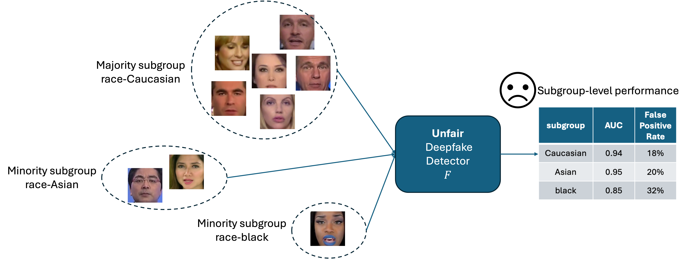
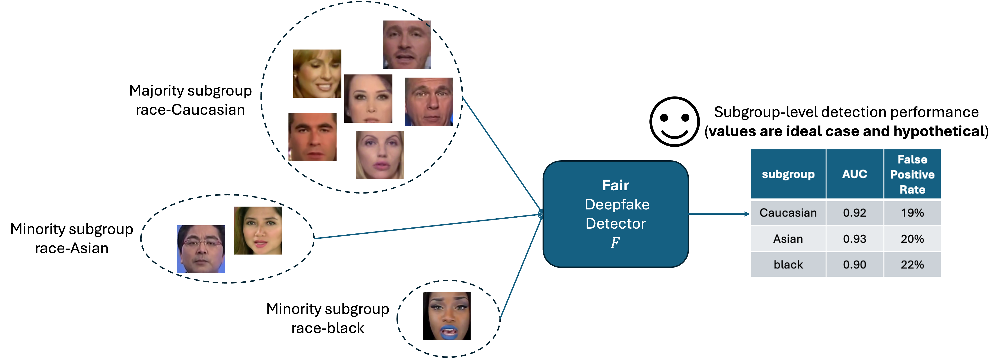
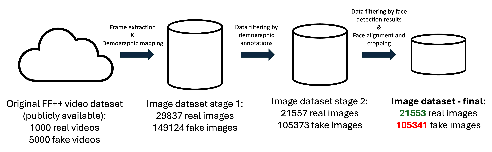
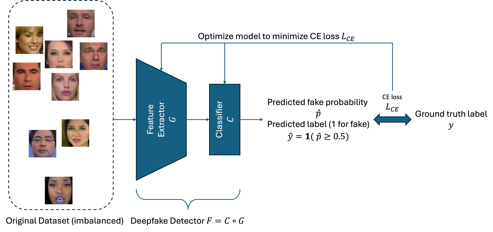
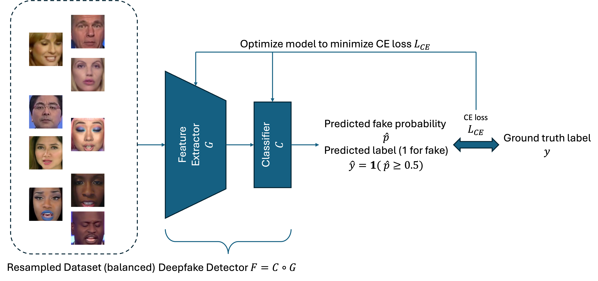
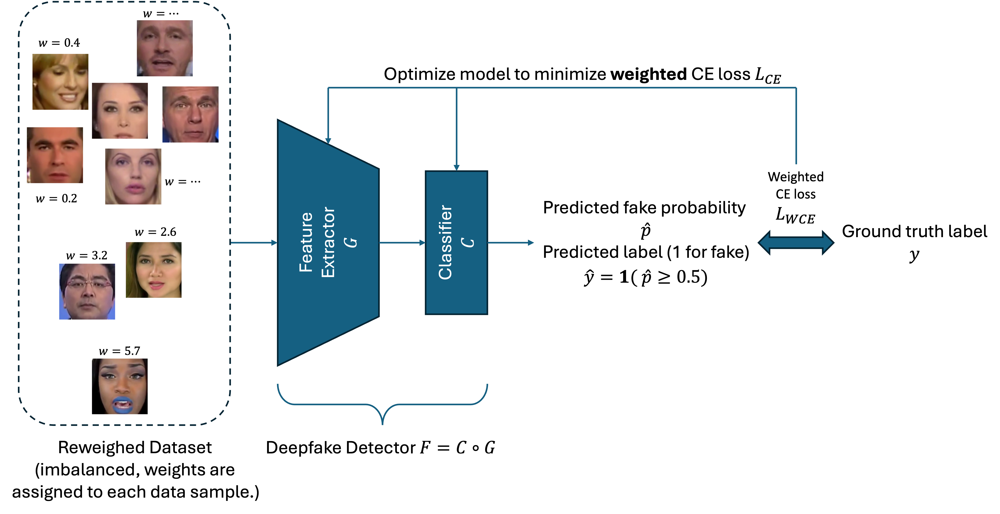
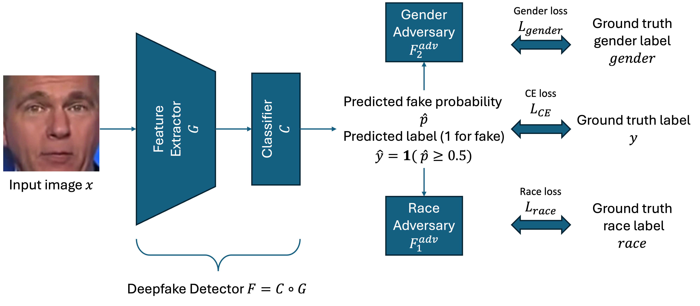
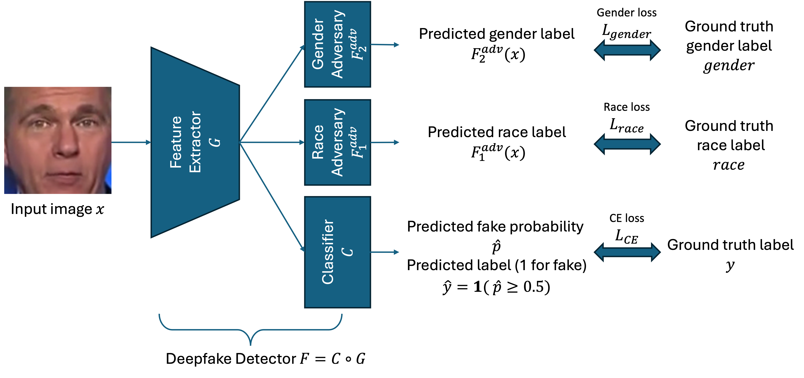

# ay2324-s2-pg14
ST5188 AY2023/24 S2 Project Group 14 Repository

This is the repository for "Exploration on Fair Deepfake Detection across Race and Gender".

In this project, it is aimed to explore and attempt to improve the fairness of deepfake detection. 



# Create Environment
Run the codes below to build the virtual environment for this project and install all dependencies.

```
git clone https://github.com/nus-st5188/ay2324-s2-pg14.git
cd ay2324-s2-pg14
conda create -n fairdeepfake python=3.8
conda activate fairdeepfake
pip install -r requirements.txt
```

# Dataset preparation

We build our project on the top of public deepfake datasets [FF++](https://github.com/ondyari/FaceForensics), [FaceShifter](https://github.com/ondyari/FaceForensics) (included as a fake subset in FF++ in this project), [DFD](https://github.com/ondyari/FaceForensics), and [Celeb-DF](https://github.com/yuezunli/celeb-deepfakeforensics). We conduct data pre-processing as shown below figure to match the extracted frames to the corresponding demographic annotations provided by ["A comprehensive analysis of ai biases in deepfake detection with massively annotated databases"](https://github.com/xuyingzhongguo/DeepFakeAnnotations). The data pre-processing codes can be found in  ```data_preparation``` folder. Due to the time limitation, we only conduct experiments on FF++ dataset even though we have pre-processed all FF++ (having FaceShifter as a fake subset), DFD, and Celeb-DF datasets. To reproduce our experiments, it is more suggested to download the processed FF++ dataset by us via [OneDrive link](https://nusu-my.sharepoint.com/:u:/g/personal/e0950472_u_nus_edu/EZkYj8zJ_ShIpyr315ahuqEBl19hwYV-hZ9LgdZU3hTGfw?e=RYI6d8) instead of processing from the raw original dataset, please be reminded to use NUS OneDrive account since this link is exclusive to NUS users. 



# Training for Fair Deepfake Detection
After finishing downloading and preparing the dataset, please modify all the ```.json``` files in the folder ```./data_split``` to change the ```image_path``` to your own image path, otherwise, you will encounter errors in the following training codes.

## Baseline


For baseline training, first, run the code below to figure out the arguments before running the training codes.
```
python train.py --h
```
Note that the data split files for baseline training are ```updated_idx_train.json```, ```updated_idx_val.json```, ```updated_idx_test.json```.

Here is an example of training a baseline ResNet-18 model.

```
python training/train.py --model ResNet-18 --gpu 0
```

## Resampling


For fair training using the resampling method, first, run the code below to figure out the arguments before running the training codes.
```
python train_resample.py --h
```

Note that the training data split files for baseline training are ```updated_idx_train_aug.json```, ```updated_idx_train_aug_2.json```, where the former is for resampling method with all augmentations () and resampling method with a subset of augmentations().

Here is an example of training a ResNet-18 model using resampling with all augmentations.
```
python train_resample.py --training_set updated_idx_train_aug.json --gpu 0 --model ResNet-18
```

## Reweighing


For fair training using the reweighing method, first, run the code below to figure out the arguments before running the training codes.
```
python train_reweigh.py --h
```
Note that the data split files for baseline training are ```updated_idx_train.json```, ```updated_idx_val.json```, ```updated_idx_test.json```.

Here is an example of training a ResNet-18 model using the reweighing method.
```
python train_reweight.py --model ResNet-18 --sensitive_attr intersec --gpu 0
```

## Adversarial Learning

While leveraging adversarial learning strategy to improve fairness, we have two variants according to the different inputs for adversaries, namely adversarial learning with predicted probability and adversrial learning with feature.



For fair training using the reweighing method, first, run the code below to figure out the arguments before running the training codes.
```
python train_adv.py --h
```
Note that the training data split files for baseline training are ```updated_idx_train_adv_training.json```, ```updated_idx_val_adv_training.json```, ```updated_idx_test_adv_training.json```.

Here is an example of training a ResNet-18 model using the reweighing method.
```
python training/train_adv.py --model ResNet-18 --gpu 0 --adv_input feature
```
# Inference
After finishing training a model, you will find the autosaved checkpoints (model weights file) in the    ```./training/ckpt``` folder. To evaluate the trained model, you should use the evaluation code which output the overall and subgroup level detection performances and data instance level predictions.

First, run the code below to figure out the arguments before running the training codes.
```
python evaluate.py --h
```

Here is an example of evaluating a trained ResNet-18 model.

```
python evaluate.py --model ResNet-18 \
--ckpt ./ckpt/useful_ckpt/reweigh/gender-group/20240331_213432_ResNet-18_lr0.0005_100.pth \ # change the checkpoint to yours
--output_path ./outputs/reweigh/gender-group \ # change your own output path
-bs 256
```

Once the evaluation is done, you can find the results in the output path in the argument.

# References
```
@inproceedings{rossler2019faceforensics++,
  title={Faceforensics++: Learning to detect manipulated facial images},
  author={Rossler, Andreas and Cozzolino, Davide and Verdoliva, Luisa and Riess, Christian and Thies, Justus and Nie{\ss}ner, Matthias},
  booktitle={Proceedings of the IEEE/CVF international conference on computer vision},
  pages={1--11},
  year={2019}
}

@inproceedings{li2020celeb,
  title={Celeb-df: A large-scale challenging dataset for deepfake forensics},
  author={Li, Yuezun and Yang, Xin and Sun, Pu and Qi, Honggang and Lyu, Siwei},
  booktitle={Proceedings of the IEEE/CVF conference on computer vision and pattern recognition},
  pages={3207--3216},
  year={2020}
}

@misc{dfd,
    title = {Contributing Data to Deepfake Detection Research},
    url = {https://blog.research.google/2019/09/contributing-data-to-deepfake-detection.html},
    month = {September},
    year = {2019}
}

@article{li2019faceshifter,
  title={Faceshifter: Towards high fidelity and occlusion aware face swapping},
  author={Li, Lingzhi and Bao, Jianmin and Yang, Hao and Chen, Dong and Wen, Fang},
  journal={arXiv preprint arXiv:1912.13457},
  year={2019}
}

@article{xu2022comprehensive,
  title={A comprehensive analysis of ai biases in deepfake detection with massively annotated databases},
  author={Xu, Ying and Terh{\"o}rst, Philipp and Raja, Kiran and Pedersen, Marius},
  journal={arXiv preprint arXiv:2208.05845},
  year={2022}
}
```

